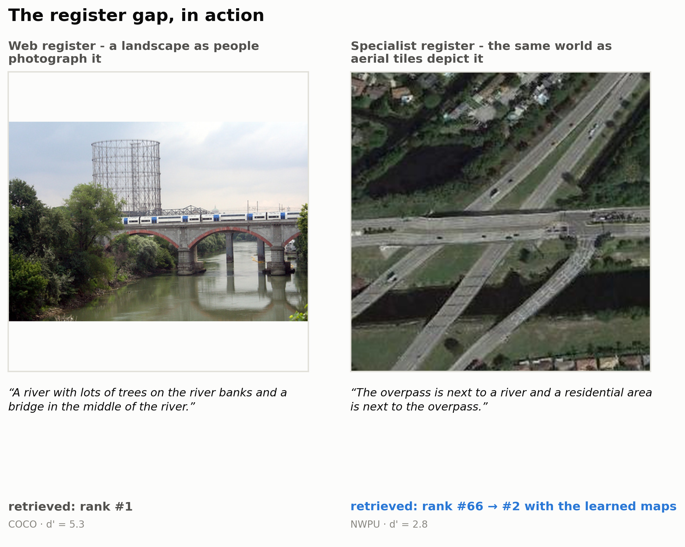
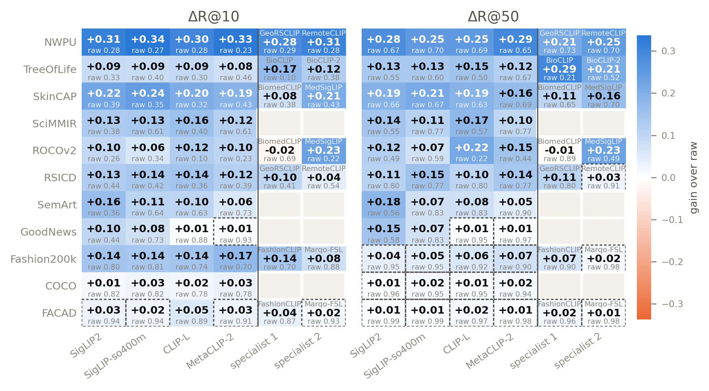
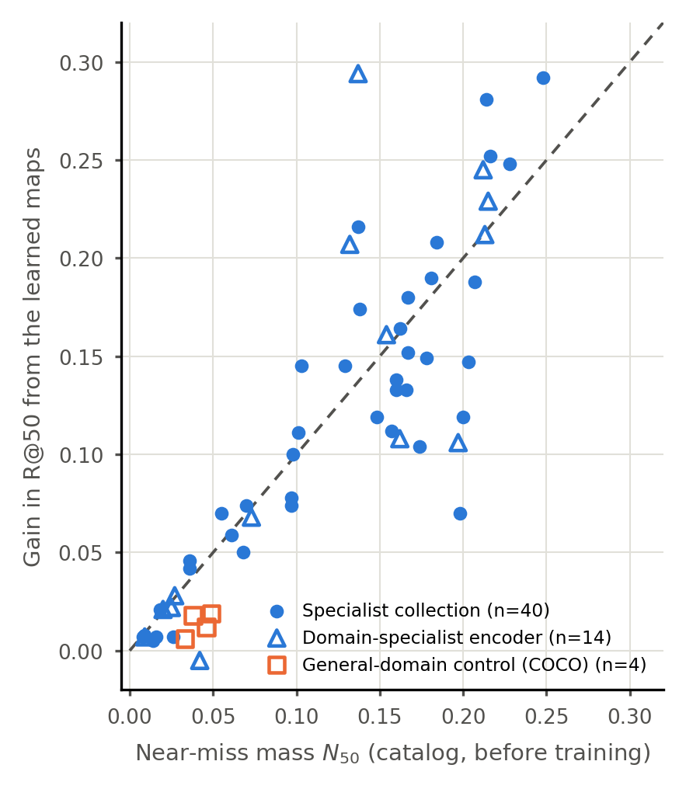
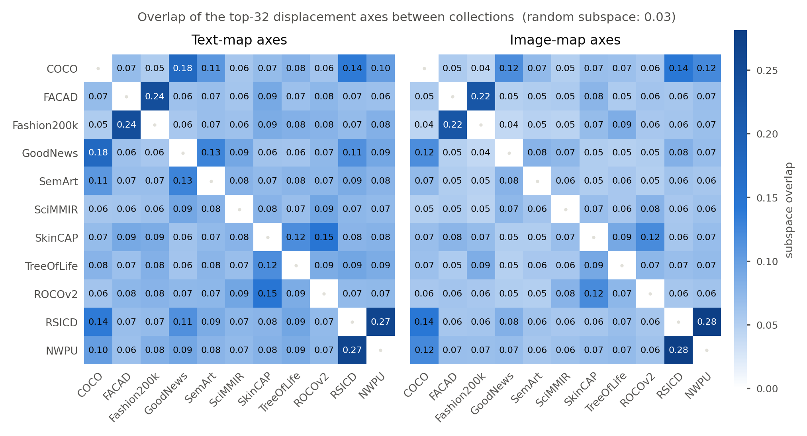
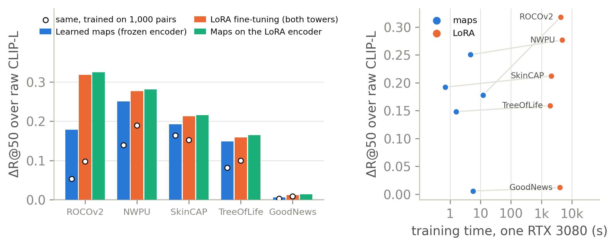
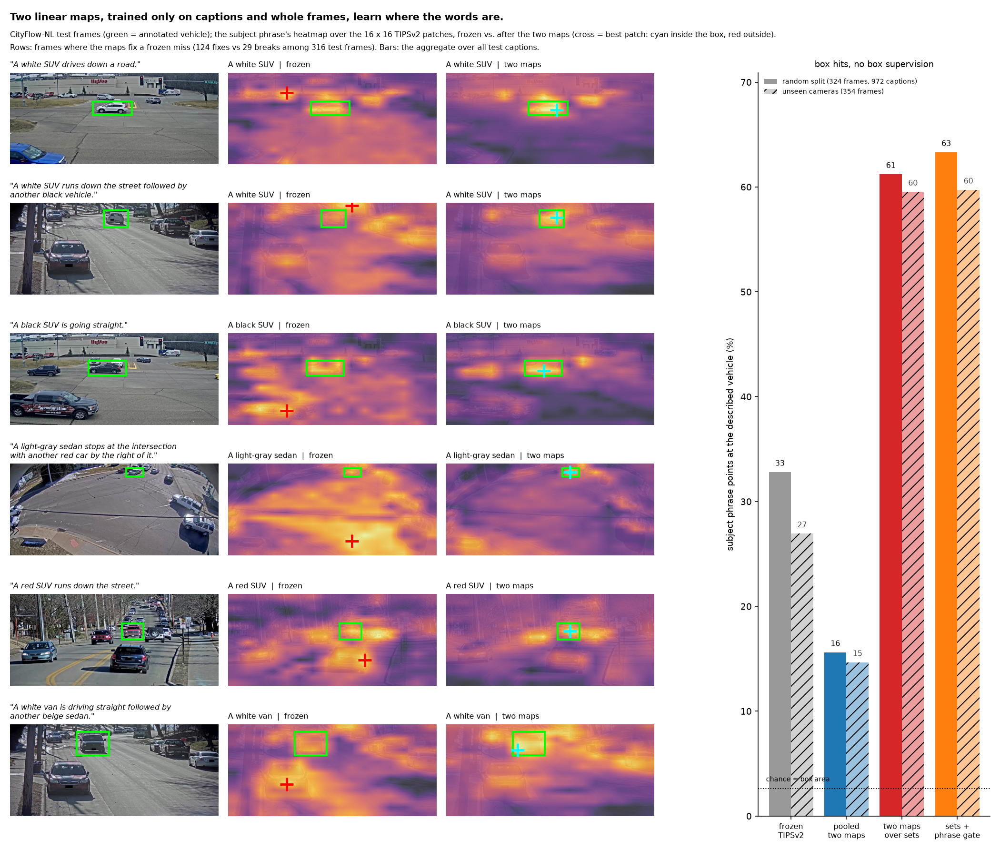

# Learn the (Register) Gap

**Making effective specialist text-to-image retrieval with generalist encoders.**
Code, configuration, result files and the released embedding cache for the paper; everything in the paper is reproduced
from this repository with one command.

<p align="center"></p>

Frozen vision–language encoders are the default index for text-to-image retrieval. On specialist collections — radiology
archives, herbaria, satellite tiles, museum catalogues, product databases — they under-perform, even when the domain appears in
web-scale training data. This is not a domain gap, where concepts are missing. It is a **register gap**: specialist collections
describe and depict their contents differently (a caption that says what an image *means* rather than what it shows; an axial
CT, an overhead tile, a specimen sheet), so the encoder's arrangement of true caption–image pairs among their distractors is
wrong for that collection. The gap is specific to a collection, not to the encoder.

## What the paper shows

1. **The gap is repairable with two linear maps.** One residual affine map per modality, trained in seconds on the collection's
   own catalog pairs with the encoders' own in-batch contrastive objective, raises R@50 by a mean **+0.11** and up to **+0.29**
   across 58 encoder × collection cells (11 collections, 12 encoders); 57 of 58 cells are non-negative, and the exception is a
   specialist encoder with nothing left to repair. Web-register controls (COCO, FACAD) are unchanged: the maps do nothing where
   there is nothing to fix.
2. **The repair is predictable before any query.** The near-miss mass $N_{50}$ — the fraction of catalog pairs the frozen encoder
   ranks between 51 and 150 — predicts the gain with no fitted parameter ($R^2 = 0.73$; leave-one-collection-out $0.68$). It is a
   statistic of the frozen encoder's own ranking of the catalog, so encoders can be scored before anything is trained.
3. **The repair is a re-metric that acts on register.** A polar factorisation of the trained map shows the symmetric stretch
   carries ${\sim}98\%$ of the gain and the two-map edge is exactly the small relative rotation a tied map cannot express;
   a bottleneck MLP buys nothing over linear; the map's strongest direction is the register itself. After correction the spread
   between encoders shrinks 16–83%: raw benchmark tables on specialist collections partly rank encoders by how much register gap
   they carry.
4. **Fine-tuning is the measuring stick, not the antagonist.** LoRA on both towers, on the same pairs, ends ahead but not by much:
   the maps recover a median 90% of the LoRA gain at R@50 at a thousandth of the cost, never forget the web register, and still
   add on top of a fine-tuned encoder.
5. **The same maps over phrases and patches ground words in images with no boxes.** Applied to a caption's phrases and an
   image's patch tokens with a learned phrase gate, the maps close the remaining distance to fine-tuning on long-caption
   collections, set a new best on the SemArt Text2Art benchmark, and make a phrase's best patch land on the object it names:
   on traffic-camera frames the vehicle phrase finds the vehicle 61–63% of the time (chance 2.6%) after training on captions and
   whole images only, and the gain carries to cameras never seen in training.

<p align="center">
 <br>
<em>Left: gain in R@50 on every cell of the grid. Right: the near-miss law — the gain a linear map returns is the mass the
frozen encoder left just below the cut-off.</em>
</p>
<p align="center">
 <br>
<em>Left: what the map does — rescaling along learned axes, the strongest of which is the register. Right: the maps against
LoRA fine-tuning on the same pairs, and on top of it.</em>
</p>
<p align="center"><br>
<em>Words land on objects with no boxes: the caption's vehicle phrase as a heat-map over patches, frozen vs. after the two maps.</em></p>

## Reproduce the paper

The unit of this pipeline is an **embedding cache**: one file per (collection, encoder) cell holding the caption and image
embeddings, the split, the captions and the pair ids. Every number in the paper is a function of these files. The 58 cells
of the grid (12.8 GB) are released as a public Hugging Face dataset,
[`RegisterGap/LearnTheRegisterGapCache`](https://huggingface.co/datasets/RegisterGap/LearnTheRegisterGapCache), with a
sha256 manifest (`configs/cache_manifest.json`).

```bash
git clone <this repository> && cd learn-the-gap
pip install numpy torch                       # torch only for training the maps; numpy suffices for the verification stage

python scripts/reproduce.py                   # fetch the cache (resumable), verify raw R@10/R@50 of all 58 cells to 4 decimals
python scripts/reproduce.py --train           # + retrain the two-map and tied-map arms of every cell (~30 min on one RTX 3080)
                                              #   and compare with the committed results within 0.01
```

Any missing cell is fetched on demand, so single experiments work straight away:

```bash
python -m ltg.maps.linear --collection skincap --encoder siglip2-so400m-16-384 --arms both shared --seeds 0 1 --baselines
python -m ltg.maps.mlp    --collection rsicd   --encoder siglip2-so400m-16-384
```

To reproduce from **your own embeddings** instead (e.g. a re-encoding from the raw datasets), point the pipeline at your folder
and switch the download off; the layout is documented in `ltg/cache.py`:

```bash
LTG_CACHE=/path/to/your/cache LTG_OFFLINE=1 python scripts/reproduce.py --train
```

Two checks guard the chain and are part of the release: `scripts/verify_cells.py` (raw recall from each cache must match the
committed run to four decimals; 58/58) and the `--train` comparison (retrained arms within 0.01 of the committed gains; 116/116).
Wall-clock and peak memory per cell are in `results/timing_cells.csv` (one training run: median 5 s, max 22 s, ≈0.3 s per
thousand pairs; the whole grid in 26 minutes on one consumer GPU).

## What is in the repository

    ltg/cache.py          the store: load/save cells, on-demand fetch from the released cache, hash check
    ltg/eval/             recall, near-miss mass N50, d', published protocols (Derm1M, RSICD, Text2Art), grounding (box hit, pointing game)
    ltg/maps/linear.py    the method: text / image / two-map / tied-map arms + training-free baselines (CSLS, QB-Norm, centering, gap closure)
    ltg/maps/mlp.py       the non-linear control (bottleneck MLP per side, same recipe)
    ltg/maps/sets.py      two maps over sets: phrases x patches with the learned gate
    ltg/maps/lora.py      LoRA / head-FT comparators, maps on top of LoRA (Colab jobs under jobs/)
    ltg/encoders/         encoder registry (configs/encoders.json), per-patch embeddings, phrase sets, API embedders
    ltg/analysis/         predictors of the gain, naming the map's directions
    configs/              encoders, collections and splits, the cells of every table, published numbers, cache manifest + release
    results/              one JSON per (collection, encoder, experiment): every number in the paper, plus timing and verification CSVs
    data/                 pairs.jsonl and annotation manifests per collection (no images; sources and licences in configs/collections.json)
    docs/                 figures, the case-study memos, DEVELOPMENT.md (status, decisions, porting notes)
    scripts/              reproduce.py, fetch_cache.py, verify_cells.py, timing_table.py, pack_cache.py, make_anon_release.py

The recipe, everywhere: residual zero-initialised map(s) $\phi(x)=\mathrm{normalize}(x + Wx + b)$, in-batch InfoNCE with
$\tau = 0.05$, AdamW $10^{-4}$ / weight decay $10^{-4}$, batch 256, 30 epochs, the epoch with the best validation R@50, two seeds.
Test split = gallery; target = identity. Encoders are named once in `configs/encoders.json` and every table names its encoder.

## Collections and encoders

Eleven collections spanning six domains — ROCOv2 and SkinCAP (medicine), NWPU-Captions and RSICD (remote sensing), Fashion200k
and FACAD (fashion), SemArt (art), SciMMIR (scientific figures), GoodNews (news), TreeOfLife-10M (biodiversity), COCO (web
control) — under four generic encoders (SigLIP2 so400m/16-384, SigLIP so400m, CLIP ViT-L/14 LAION-2B, MetaCLIP-2) and eight
domain specialists (MedSigLIP, BiomedCLIP, RemoteCLIP, GeoRSCLIP, FashionCLIP, Marqo-FashionSigLIP, BioCLIP, BioCLIP-2).
Case studies add SigLIP2-B/256, TIPSv2-B/14 and Gemini Embedding 2, and the grounding sets CityFlow-NL and Flickr30k Entities.
Split rules, sources and licences: `configs/collections.json`. The datasets themselves are not redistributed; the embedding cache
contains no images or captions beyond what the collections' licences permit, and CityFlow-NL frames must be obtained from the
AI City Challenge under its licence.

## Citation

Under review. A citation entry will be added on publication.
